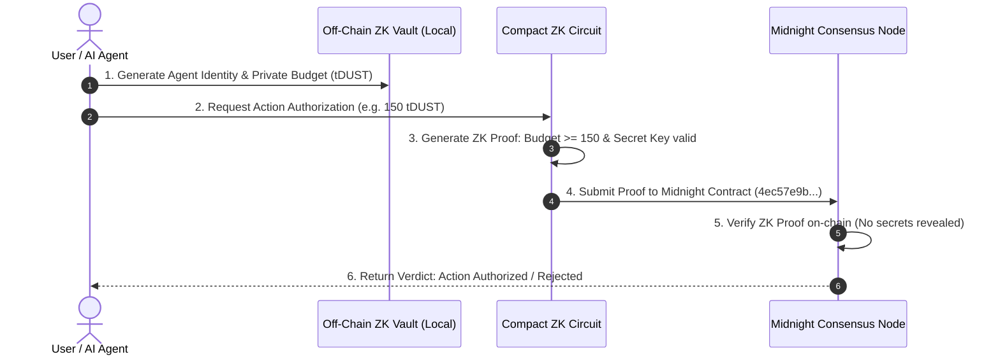

# AgentPassport — Project Proposal

> **The Privacy Layer for Autonomous AI Agents**
>
> Give AI agents cryptographic permissions — not unrestricted access.
> Prove authorization with Zero-Knowledge Proofs. Reveal nothing.

---

## 🎯 Track
**AI (Midnight Request for Startups)** — Level 4 Builder Challenge

## 🏷️ Product Name
**AgentPassport**

## 🌐 Quick Links & Verification

| Resource | Link |
|----------|------|
| 🚀 **Live Demo** | [midnight-level-4.vercel.app](https://midnight-level-4.vercel.app/) |
| 🎬 **Demo Video** | [Watch Video Walkthrough on Google Drive](https://drive.google.com/file/d/1VCleits574larlz8Nv94vhmkl2xzGDHW/view?usp=sharing) |
| 📜 **Smart Contract** | [`4ec57e9b77711da44ecfe6d2dd5be638fcb14832b8821290dce4f04561add3a4`](https://explorer.preview.midnight.network/contracts/4ec57e9b77711da44ecfe6d2dd5be638fcb14832b8821290dce4f04561add3a4) |
| 🔍 **Midnight Explorer** | [Block 914,791 — Verified SUCCESS](https://explorer.preview.midnight.network/contracts/4ec57e9b77711da44ecfe6d2dd5be638fcb14832b8821290dce4f04561add3a4) |
| 🐦 **X (Twitter)** | [@AgentPassport05](https://x.com/AgentPassport05) |
| 💻 **GitHub Repository** | [github.com/ArchishmanS2005/midnight_Level-4](https://github.com/ArchishmanS2005/midnight_Level-4) |

---

> [!IMPORTANT]
> **The Core Problem**: Autonomous AI agents must act independently, but granting them full access to private keys or bank limits creates an unacceptable security risk. Requiring manual approval for every transaction destroys autonomy.

## 🚨 Problem Statement

Autonomous AI agents are increasingly trusted to execute sensitive, high-value tasks on behalf of human users:
- Booking hotels and travel tickets
- Purchasing hardware or digital services
- Interacting with paid APIs & LLM inference endpoints
- Managing sensitive user files and personal policies

**The status quo forces a broken binary choice:**
1. **Unrestricted Access**: Give the agent full private keys / cards — *catastrophic risk if compromised or hijacked by prompt injection.*
2. **Manual Approval**: Prompt the human for every single micro-action — *ruins autonomous operation.*

There is no middle ground: **No native cryptographic method to give an agent permission for *exactly* what it needs, provably, without exposing private data on-chain.**

---

## 💡 The AgentPassport Solution

> [!NOTE]
> **Zero-Knowledge Permissioning**: AgentPassport uses Midnight's private state to prove that an agent holds sufficient budget and valid credentials *without ever revealing the budget amount, agent identity, or credentials.*

**AgentPassport** is a privacy-first cryptographic authorization protocol built on the **Midnight Network**. It enables autonomous AI agents to prove permission compliance via **Zero-Knowledge Proofs (ZKPs)** on Midnight Preview Network.

### How It Works

1. **Agent Registration**: User generates a private agent key (`agent_secret_key`) and credential hash (`credential_hash`).
2. **Action Request**: Agent requests authorization for an action specifying requested cost (e.g., `150 tDUST`).
3. **Client-Side ZK Proof**: AgentPassport generates a zero-knowledge proof proving `permission_budget >= requested_amount` locally.
4. **On-Chain Verification**: Midnight smart contract verifies the ZK proof on-chain without learning the budget or credentials.
5. **Private State Guarantee**: The ledger updates public counters (`total_authorizations`), leaving all underlying secrets off-chain.

---

## ✨ Core Features & Deliverables

| Feature | Description | Status |
|---------|-------------|--------|
| 🤖 **AI Agent Passport Vault** | Private identity creation & local credential hashing | ✅ Completed |
| 🔐 **Private Permission Engine** | ZK inequality circuit (`budget >= requested_amount`) | ✅ Completed |
| 📜 **Midnight Compact Contract** | On-chain deployment on Midnight Preview Network | ✅ Verified (`4ec57e9b...`) |
| 💼 **Lace Wallet Integration** | Seamless connection & DApp API transaction signing | ✅ Completed |
| ⚡ **Real-Time ZK Dashboard** | React 18 + Vite + Tailwind CSS control center | ✅ Live on Vercel |
| 🧪 **Comprehensive Test Suite** | 12/12 Jest unit & contract integration tests passing | ✅ 100% Passing |
| 🔄 **Automated CI/CD Pipeline** | GitHub Actions build, test, and artifact pipeline | ✅ Passing |

---

## 🔒 Privacy Model (Zero-Knowledge Architecture)

### 🌐 Public State (On-Chain Ledger)
Only aggregate statistics are recorded on the Midnight blockchain:
- `agent_count`: Total registered active agents
- `total_authorizations`: Total approved actions
- `total_rejections`: Total denied actions

### 🔑 Private Witnesses (Local Device Only — Never On-Chain)
All sensitive parameters remain strictly off-chain inside the local ZK circuit environment:
- `agent_secret_key`: Private 256-bit agent identity key
- `permission_budget`: Spending limit in tDUST
- `credential_hash`: Cryptographic fingerprint of credentials

### 🛡️ What the ZK Circuit Proves (Without Exposing Data)
- `budget >= requested_amount` — Proves financial capability without revealing budget
- `agent_secret_key != 0` — Proves agent existence without revealing identity
- `credential_hash != 0` — Proves credential validity without exposing credential
- `Caller ownership` — Proves user owns the passport secret key

---

## 🛠️ Technology Stack

| Layer | Technology | Role |
|-------|-----------|------|
| **Smart Contract** | [Midnight Compact](https://docs.midnight.network) | Domain logic & ZK proof verification |
| **ZK Circuits** | Auto-generated Compact Circuits | Selective disclosure & private assertions |
| **Blockchain** | Midnight Preview Network | Decentralized consensus & state management |
| **Wallet API** | [Lace Wallet](https://www.lace.io) | DApp connection & transaction signing |
| **Frontend** | React 18 + Vite + TypeScript | Modern glassmorphism control center UI |
| **Styling** | Tailwind CSS + Vanilla CSS | Dark mode modern aesthetics |
| **Testing** | Jest + `ts-jest` | Contract logic & circuit verification suite |
| **CI/CD** | GitHub Actions | Automated build & test execution |

---

## 🚀 Why Midnight Network?

> [!TIP]
> **Why Midnight is Essential**: Midnight is the only blockchain architecture offering native private state coupled with zero-knowledge proof verification at scale. Compact allows developers to write straightforward imperative code that automatically compiles into ZK circuits.

Without Midnight, building private agent authorization requires custom ZK-SNARK circuits, complex trusted setups, or expensive off-chain rollups. Midnight's Compact language makes private state a first-class citizen.

---

## 👨‍💻 Team & Developer Information

- **Developer**: Archishman Sarkar
- **GitHub**: [github.com/ArchishmanS2005](https://github.com/ArchishmanS2005)
- **Role**: Solo Builder & Midnight Ecosystem Developer
- **Challenge**: [Midnight Builder Challenge](https://risein.com) Level 4 — Track: AI (Midnight Request for Startups)

---

## 📄 License

This project is licensed under the [MIT License](./LICENSE).
