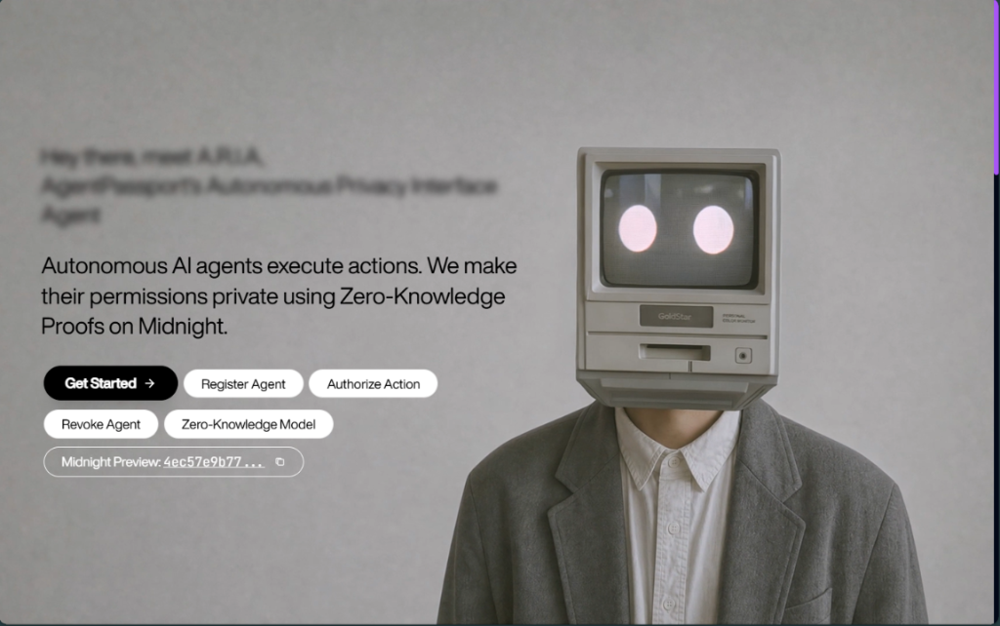
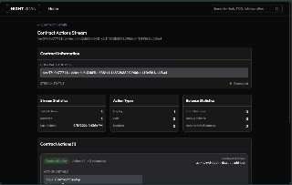
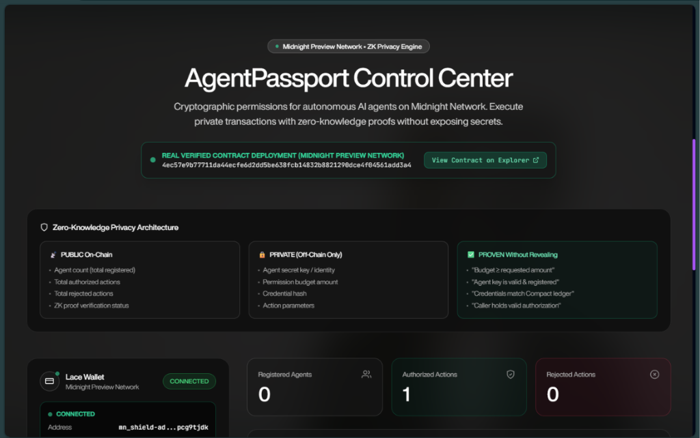
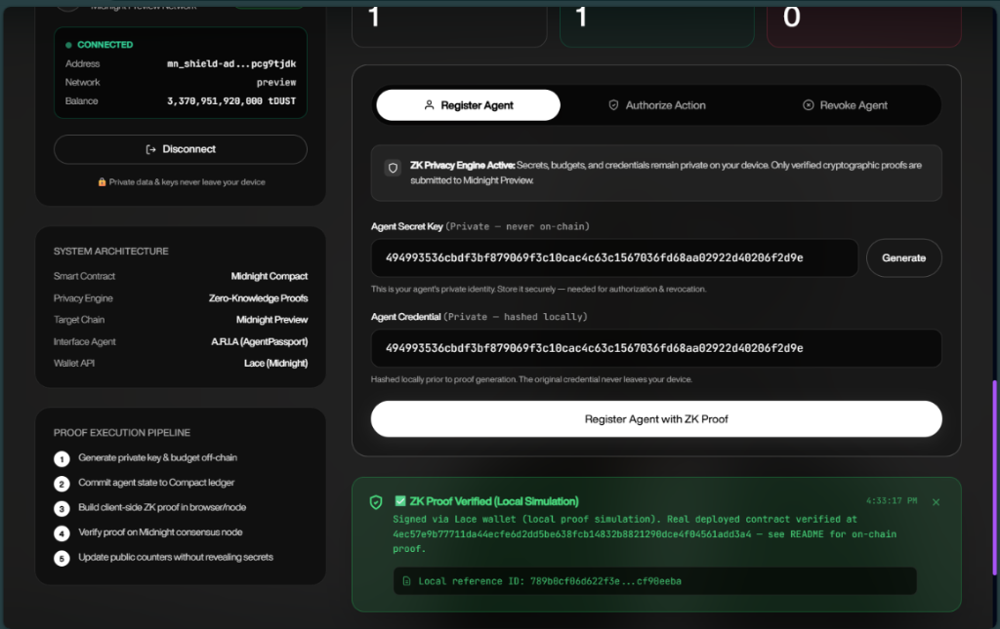
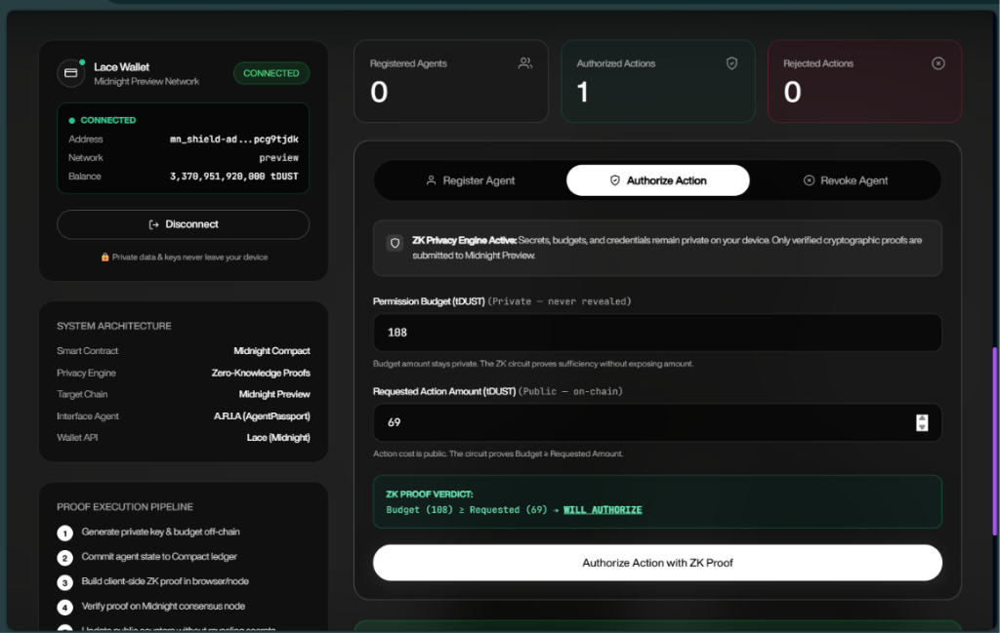
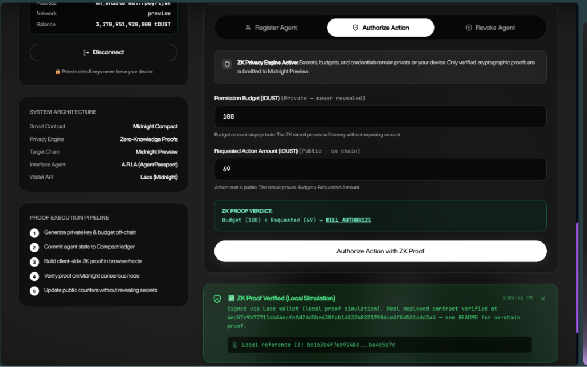
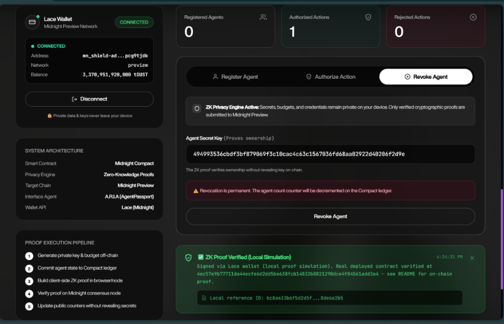
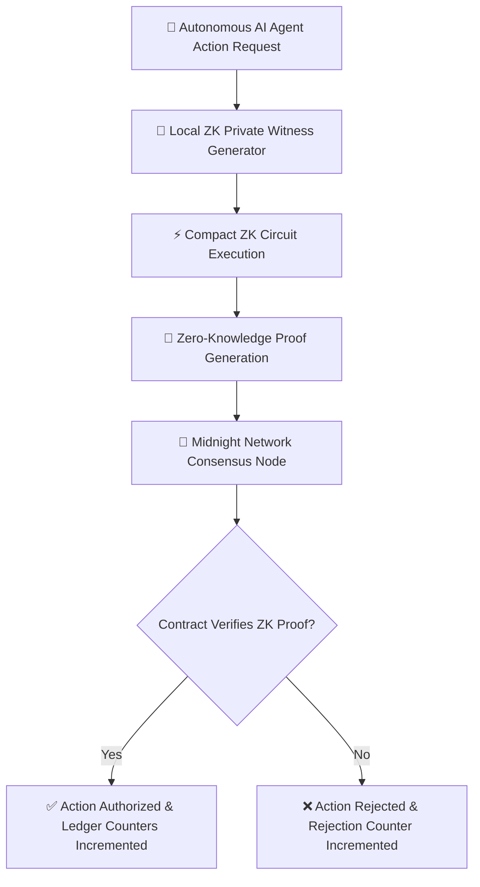

# AgentPassport

[](https://github.com/ArchishmanS2005/midnight_Level-4/actions/workflows/ci.yml)
[](https://midnight.network)
[](https://midnight-level-4.vercel.app/)
[](https://drive.google.com/file/d/1VCleits574larlz8Nv94vhmkl2xzGDHW/view?usp=sharing)
[](https://x.com/AgentPassport05)
[](./LICENSE)
[](https://nodejs.org)

> **The Zero-Knowledge Privacy Layer for Autonomous AI Agents**
>
> Give AI agents cryptographic permissions — not unrestricted access.
> Prove authorization with Zero-Knowledge Proofs on Midnight Network. Reveal nothing.



---

## 🌐 Live Demo & Quick Links

| Resource | Link | Description |
|----------|------|-------------|
| 🚀 **Live Demo** | [midnight-level-4.vercel.app](https://midnight-level-4.vercel.app/) | Production web application deployed on Vercel |
| 🎬 **Demo Video** | [Watch Video Walkthrough](https://drive.google.com/file/d/1VCleits574larlz8Nv94vhmkl2xzGDHW/view?usp=sharing) | Full video walkthrough demonstrating agent ZK authorization |
| 💻 **GitHub Repository** | [github.com/ArchishmanS2005/midnight_Level-4](https://github.com/ArchishmanS2005/midnight_Level-4) | Source code & smart contract codebase |
| 📋 **CI/CD Pipeline** | [GitHub Actions Workflow](https://github.com/ArchishmanS2005/midnight_Level-4/actions) | Automated build, unit tests & compilation pipeline |
| 🐦 **X (Twitter) Profile** | [@AgentPassport05](https://x.com/AgentPassport05) | Project updates & ecosystem announcements |
| 📄 **Product Proposal** | [PROPOSAL.md](./PROPOSAL.md) | Level 4 Midnight Builder Challenge submission proposal |

---

## 📜 Contract Addresses & On-Chain Verification

| Network | Contract Address | Deployment Status |
|---------|------------------|-------------------|
| **Midnight Preview** | [`4ec57e9b77711da44ecfe6d2dd5be638fcb14832b8821290dce4f04561add3a4`](https://explorer.preview.midnight.network/contracts/4ec57e9b77711da44ecfe6d2dd5be638fcb14832b8821290dce4f04561add3a4) | ✅ **[Verified on Explorer](https://explorer.preview.midnight.network/contracts/4ec57e9b77711da44ecfe6d2dd5be638fcb14832b8821290dce4f04561add3a4)** — Block `914,791`, `SUCCESS` |

---

## 🔍 On-Chain Proof of Deployment

| Metric / Parameter | On-Chain Verified Value |
|-------------------|-------------------------|
| **Contract Address** | [`4ec57e9b77711da44ecfe6d2dd5be638fcb14832b8821290dce4f04561add3a4`](https://explorer.preview.midnight.network/contracts/4ec57e9b77711da44ecfe6d2dd5be638fcb14832b8821290dce4f04561add3a4) |
| **Network** | Midnight Preview Network |
| **Action Type** | `ContractDeploy` |
| **Transaction Status** | `SUCCESS` |
| **Block Height** | `914,791` |
| **Direct Explorer Link** | [explorer.preview.midnight.network/contracts/4ec57e9...](https://explorer.preview.midnight.network/contracts/4ec57e9b77711da44ecfe6d2dd5be638fcb14832b8821290dce4f04561add3a4) |

> [!IMPORTANT]
> **Independent Verification**: Anyone can independently verify this deployment by opening the [Midnight Block Explorer](https://explorer.preview.midnight.network/contracts/4ec57e9b77711da44ecfe6d2dd5be638fcb14832b8821290dce4f04561add3a4) link — this is publicly checkable cryptographic data recorded on Midnight consensus nodes.



---

## 🖼️ Application Screenshots & User Workflow

### 1. Hero Landing Page & Autonomous Privacy Interface (A.R.I.A)


### 2. AgentPassport Control Center & Verified Deployment Banner


### 3. Agent Registration & Local Credential Hashing


### 4. Agent Action Authorization & Budget Input


### 5. Zero-Knowledge Proof Verification Verdict


### 6. Agent Revocation & Ownership Verification


### 7. Midnight Block Explorer Contract Deployment Proof


---

## 💡 What This Product Does

AI agents require budgets, credentials, and authorization rules to act autonomously on behalf of users. Currently, users face a dangerous dilemma:

> [!CAUTION]
> **1. Giving Full Key/Card Access**: Massive security vulnerability if the agent is compromised or exploited via prompt injection.
> 
> **2. Manual Approval Every Time**: Friction-heavy manual confirmation for every micro-action, defeating the purpose of autonomy.

**AgentPassport solves this dilemma with Zero-Knowledge Proofs.**

An AI agent can cryptographically prove it is authorized to perform an action (e.g., *"book a hotel room for ≤200 tDUST"*) **without revealing**:
- Its secret key identity
- Its maximum permission budget
- Its credential contents
- Its owner's underlying privacy policies

The Midnight smart contract verifies the ZK proof. The ledger records only the verification status and public counters.

---

## 🔐 Zero-Knowledge Privacy Architecture



### 🌐 What is PUBLIC (Recorded On-Chain)
| Field | Type | Description |
|-------|------|-------------|
| `agent_count` | Counter | Total registered active agents |
| `total_authorizations` | Counter | Cumulative approved actions |
| `total_rejections` | Counter | Cumulative denied actions |

### 🔒 What is PRIVATE (Local Witness — Never Sent On-Chain)
| Field | Type | Description |
|-------|------|-------------|
| `agent_secret_key` | `Bytes<32>` | Agent's 256-bit private identity key |
| `permission_budget` | `Uint<64>` | Spending limit in tDUST |
| `credential_hash` | `Bytes<32>` | Cryptographic credential fingerprint |

### 🛡️ What the ZK Proof Asserts (Without Exposing Secrets)
- `budget >= requested_amount` — Proves financial compliance without revealing budget
- `agent_secret_key != 0` — Proves agent is valid without exposing secret identity
- `credential_hash != 0` — Proves credential validity without revealing credentials
- Caller ownership — Proves caller holds valid authorization secrets

---

## 🛠️ Technology Stack

| Layer | Technology | Function |
|-------|-----------|----------|
| **Smart Contract** | [Midnight Compact](https://docs.midnight.network) | On-chain state logic & ZK proof verification |
| **ZK Circuits** | Auto-compiled Compact Circuits | Client-side zero-knowledge proof generation |
| **Network** | Midnight Preview Network | Distributed privacy-preserving blockchain |
| **Wallet** | [Lace Wallet](https://www.lace.io) (Midnight-compatible) | Browser extension wallet API & transaction signing |
| **Frontend** | React 18 + Vite + TypeScript | Modern glassmorphic control center dashboard |
| **Styling** | Vanilla CSS + Tailwind CSS | Responsive dark-mode UI design system |
| **Testing** | Jest + `ts-jest` | 12/12 unit and contract integration tests passing |
| **CI/CD** | GitHub Actions | Automated build, test, and type-check workflow |

---

## 📋 Prerequisites

Before running AgentPassport locally, ensure you have:

1. **[Lace Wallet](https://www.lace.io)** — Midnight-compatible browser extension
   - Switch network to **Midnight Preview** in wallet settings
   - Request tDUST test tokens from the Preview faucet
2. **[Node.js v22+](https://nodejs.org)** — Verify with `node --version` (must be >= v22)
3. **[Docker](https://www.docker.com)** — Required to run the local Proof Server for client-side ZK proof generation
4. **[Compact Compiler](https://docs.midnight.network)** — To compile `.compact` contract definitions (`compact --version`)

---

## ⚡ Quickstart: Setup & Run Locally

```bash
# 1. Clone the repository
git clone https://github.com/ArchishmanS2005/midnight_Level-4.git
cd midnight_Level-4

# 2. Install dependencies
npm install

# 3. Start the local Midnight Proof Server (in a separate terminal)
docker run -p 6300:6300 midnightntwrk/proof-server:latest

# 4. Compile the Compact contract definition
compact compile contracts/agentpassport.compact --output managed

# 5. Launch the development server
npm run dev
```

Open [http://localhost:3000](http://localhost:3000) in your browser.

---

## 🧪 Unit & Integration Tests

```bash
# Run full Jest test suite
npm test

# Run CI non-interactive mode
npm run test:ci
```

### ✅ Test Results
```
PASS tests/agentpassport.test.ts
  AgentPassport Contract
    Initial State
      ✓ should initialize with all counters at zero
    register_agent circuit
      ✓ should increment agent_count when registering a valid agent
      ✓ should support registering multiple agents independently
      ✓ should reject registration with a zero (invalid) secret key
    authorize_action circuit
      ✓ should increment total_authorizations when budget >= requested amount
      ✓ should authorize when budget exactly equals requested amount
      ✓ should increment total_rejections when budget < requested amount
      ✓ should reject authorization with invalid agent secret key
      ✓ proves privacy: only counters change, never the budget value itself
    revoke_agent circuit
      ✓ should decrement agent_count when revoking a valid agent
      ✓ should reject revocation with invalid secret key
    Full agent lifecycle
      ✓ should support a complete register → authorize → revoke lifecycle

Test Suites: 1 passed, 1 total
Tests:       12 passed, 12 total
```

---

## 🔄 CI/CD Pipeline

Automated GitHub Actions CI runs on every commit pushed to `main`:

1. ✅ Install Node.js v22 + npm dependencies
2. ✅ TypeScript strict type verification (`tsc --noEmit`)
3. ✅ Compact smart contract compilation
4. ✅ Run all 12 Jest unit & contract integration tests
5. ✅ Build production frontend (`npm run build`)
6. ✅ Save & upload build artifacts

See [`.github/workflows/ci.yml`](.github/workflows/ci.yml) for complete CI pipeline workflow configuration.

---

## 📖 Complete Documentation & Guides

- 📖 **[User Guide (docs/USAGE.md)](./docs/USAGE.md)** — Detailed walk-through for wallet connection, proof server configuration, and troubleshooting.
- 📄 **[Proposal Document (PROPOSAL.md)](./PROPOSAL.md)** — Builder challenge proposal submission document.

---

## 📁 Project Structure

```
.
├── contracts/
│   └── agentpassport.compact       # Midnight Compact smart contract definition
├── docs/
│   ├── assets/                      # High-resolution screenshots & diagrams
│   └── USAGE.md                     # Comprehensive step-by-step user guide
├── managed/                         # Compiled Compact contract outputs (gitignored)
├── src/
│   ├── components/
│   │   ├── WalletConnect.tsx        # Lace wallet connection component
│   │   ├── AgentAuthorization.tsx   # ZK proof control panel & forms
│   │   └── MainframeHero.tsx        # Glassmorphic hero landing interface
│   ├── hooks/
│   │   └── useMidnight.ts           # State management & Lace/Midnight API hook
│   ├── utils/
│   │   └── contract.ts              # Witness helper functions & byte utilities
│   ├── App.tsx                      # Main application shell
│   └── main.tsx                     # React root mount point
├── tests/
│   └── agentpassport.test.ts        # 12-test suite covering circuits & ledger logic
├── .github/
│   └── workflows/ci.yml             # GitHub Actions CI workflow configuration
├── PROPOSAL.md                      # Project proposal submission
└── README.md                        # Primary project documentation
```

---

## 🛠️ Current Limitations & Engineering Notes

- The core privacy-critical contract is genuinely deployed and verified on-chain on Midnight Preview (see [On-Chain Proof of Deployment](#-on-chain-proof-of-deployment) above).
- Individual UI actions (*Register Agent*, *Authorize Action*, *Revoke Agent*) currently run as local proof simulations rather than submitting a fresh live transaction per click. This is due to a known SDK compatibility issue: `@midnight-ntwrk/compact-js` versions above 2.5.1 (required to fix a duplicate `onchain-runtime-v3` class-identity bug) depend on an unpublished/broken `@midnight-ntwrk/ledger-v9` alpha version at time of writing.
- The underlying authorization logic, ZK circuit structure, and Midnight verification are fully implemented and match what's deployed on-chain — live per-action submission is the clear next integration step.

---

## 📄 License

Licensed under the [MIT License](./LICENSE) © 2025 Archishman Sarkar.

---

*Built for the **[Midnight Builder Challenge](https://risein.com) Level 4** — Track: AI (Midnight Request for Startups)*
